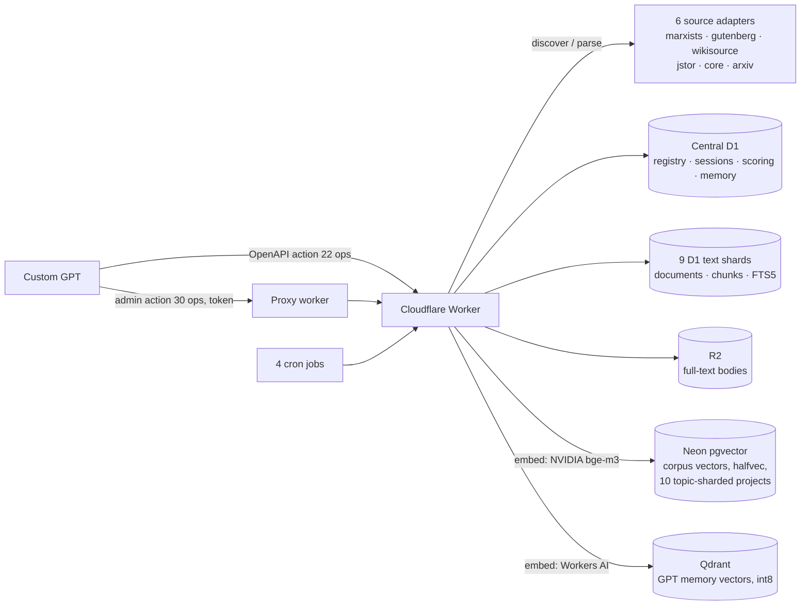

# Open Classical Text Worker

**A serverless RAG backend that turns a Custom GPT into a philosophy research assistant — built as a single Cloudflare Worker, engineered to run entirely on free-tier infrastructure.**

The worker discovers, caches, indexes, and retrieves primary-source texts from six scholarly archives (Marxists Internet Archive, Project Gutenberg, Wikisource, JSTOR, CORE, arXiv), serves them to a Custom GPT through two OpenAPI actions, and maintains its own long-term project memory — with hybrid lexical + vector retrieval, evidence-gated scoring, and multi-tier near-duplicate detection.

~36,700 lines · ~716 functions · 15 subsystems · 52 API operations · 4 cron maintenance jobs

**→ Try it live: [chunking.aminbm1919.workers.dev/demo](https://chunking.aminbm1919.workers.dev/demo)** — search the corpus yourself and flip between *lexical / semantic / hybrid (RRF)* retrieval.

**→ Read the case study: [Engineering a Production RAG Backend on $0/month](docs/CASE_STUDY.md)**

---

## Why this project is interesting

Most RAG stacks assume a beefy backend and a paid vector database. This one runs on the **Cloudflare Workers free plan** (≤50 external subrequests per request, tight CPU budget) plus the free tiers of Neon, Qdrant, and NVIDIA's inference API. Every design decision below is shaped by that constraint: fewer queries instead of more parallelism, aggressive caching, sharding, cron-driven background work with fair budgets, and durable tombstone deletes so nothing ever needs an expensive full rescan.

## Architecture at a glance



<details>
<summary>Diagram source (mermaid)</summary>



</details>

**Two entry points.** `fetch` serves the GPT's two OpenAPI actions (a routine research action and a token-guarded admin action — ChatGPT caps each action at 30 operations, so a thin proxy worker provides the second hostname). `scheduled` runs four lock-aware maintenance jobs: seasonal source reindexing, memory-vector microtasks, vector-capacity management, and daily cache pruning.

**The research pipeline** (the GPT is steered through it via `preferred_next_operation` hints in every response):

```
discover → parseDocument → searchInsideSelectedText → readChunk → scoreReadEvidence → promote
              (cache)            (candidates)         (EVIDENCE)      (1–100)
```

Two invariants hold everywhere: **candidates are not evidence** — only actually reading/parsing a text produces citable evidence with a `read_event_id`; and **memory is context only** — the GPT's stored memory never substitutes for reading sources.

## Retrieval: hybrid lexical + dense, fused with RRF

Inside a resolved text, two branches run in parallel and are fused:

- **Lexical** — SQLite FTS5 (contentless, bodies offloaded to R2) with field-weighted scoring, IDF v2 (author names are near-stopwords inside a topical corpus — semantic similarity is the reliable topical anchor), and a graded n-gram *phrase-in-title* tier signal.
- **Dense** — nearest-neighbor search over NVIDIA `bge-m3` embeddings stored as `halfvec` in Neon pgvector, topic-routed by an LLM classifier across 10 topic-sharded free projects; GPT memory vectors live separately in Qdrant (int8-quantized).
- **Fusion** — weighted Reciprocal Rank Fusion (k = 60) with cross-branch dedup; a curator-assigned `value_score` acts only as a tie-breaker, never as the selector.

## Data & durability engineering

| Store | Role | Notable engineering |
|---|---|---|
| Central D1 | cache registry, sessions, read events, scoring, GPT memory, feature flags | constant-time admin auth; `storage_policy` flag table drives ~40 runtime flags |
| 9 D1 text shards | single-copy document/chunk storage + FTS5 | shard chosen by cache-key hash, recorded in the registry (never recomputed on read) |
| R2 | full-text bodies (D1 keeps only metadata/offsets) | hash-verified reads; doubles as the ingestion inbox |
| Neon pgvector | corpus embeddings (`halfvec(1024)`) | per-project capacity tracking with value-based eviction at 90% |
| Qdrant | GPT memory embeddings (int8) | eviction cap derived from the real RAM/disk budget, not a magic number |

- **Near-duplicate dedup** — document-level SimHash with Manku et al. (WWW 2007) thresholds: a reversible *skip-embed* tier and a destructive *merge* tier that requires exact verification plus a length-tolerance guard; session-wide fuzzy-dup suspicion runs behind a cheap preflight so the expensive comparison never touches all pairs.
- **Guaranteed deletes** — tombstoned, so removals survive crashes and replay across Neon and Qdrant.
- **Evidence quality gate** — raw PDF bytes or CAPTCHA pages can never masquerade as read evidence; PDFs go through real text extraction first.
- **Anti-SSRF** — every outbound URL passes a public-HTTP validator; JSTOR is fetched at human-like rate limits.

## Testing & contract discipline

- `tools/wire-check.py` — guards the *wire contract*: response keys are compared against an allowlist; any new telemetry key is flagged as DRIFT, any debug-gated key that leaks while the debug flag is off is flagged as LEAK.
- `tools/e2e-check.py` — end-to-end regression over the live worker: discovery → read → in-text search, session paging, the full memory write/search/read/delete cycle, error-taxonomy remedies, and long-document paging.
- Deploys are marked with end-of-file version markers and logged in [docs/CHANGELOG.md](docs/CHANGELOG.md) (a ledger of ~90 deployed increments).

## Repository map

```
worker.js                  the entire worker (~36.7k lines, single source of truth)
wrangler.example.toml      deploy config template (bindings for D1 ×10, R2, Vectorize, AI)
admin-proxy/               thin second worker: gives the admin action its own hostname
tools/                     wire-contract + e2e regression checkers (Python, stdlib only)
docs/                      full engineering docs (in Persian — see note below)
  architecture.md          system overview ("factory" model)
  technical_specification.md  function-by-function spec (716 functions, 15 subsystems)
  dfd.md                   data-flow diagrams, levels 0–2
  machines.md              task-level view of the factory
  ROUTES.md                route-liveness audit (live vs. legacy, per-route guard table)
  FLAGS.md                 runtime feature-flag reference
  WIRE_CONTRACT.md         the slim wire contract enforced by wire-check
  CHANGELOG.md             deploy ledger
  design/                  design documents (SimHash dedup, Neon corpus vectors,
                           incremental ingest, IR ranking research, topic routing, FTS)
```

> **Note on documentation language:** the engineering docs are written in Persian (Farsi) — the project is documented end-to-end, function-by-function. The code, identifiers, and inline comments in `worker.js` are in English.

## Deploying your own instance

1. Create the resources on your Cloudflare account: one central D1 database, nine shard D1 databases, an R2 bucket, and (optionally) Vectorize indexes and external Neon/Qdrant stores.
2. Copy `wrangler.example.toml` → `wrangler.toml` and fill in your account ID and database IDs.
3. Set secrets (names only — nothing is hardcoded):
   `ADMIN_TOKEN`, `MEMORY_WRITE_TOKEN`, `JINA_API_KEY`, `EXA_API_KEY`, `NVIDIA_API_KEY`, `QDRANT_API_KEY`, `QDRANT_URL`, `CORE_API_KEY`
4. `npm install && npx wrangler deploy`
5. Point the regression tools at your instance: `WORKER_BASE_URL=https://your-worker.workers.dev python tools/e2e-check.py`

## License

MIT
