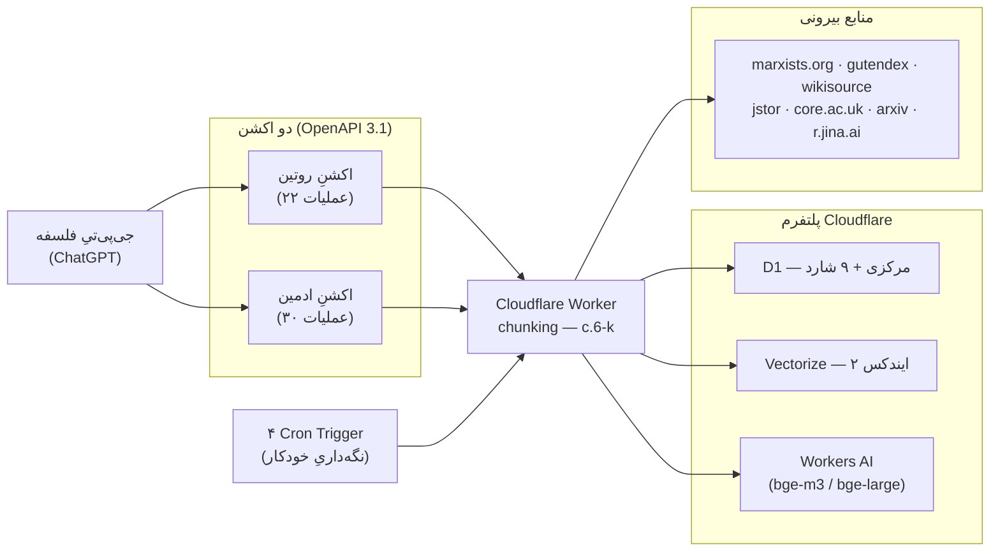
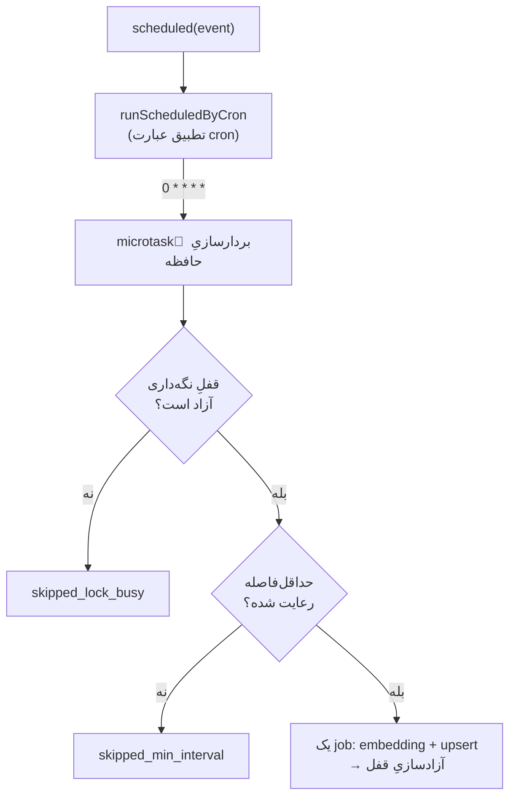
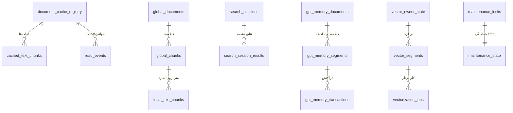

# سند معماری — Open Classical Text Worker
### نسخهٔ `2.9.40-c.6-k-score-nonconsequential-wikisource-hint-fix`

> این سند، نمای کلانِ سامانه را با استعارهٔ **کارخانه** توصیف می‌کند: مواد خام (متنِ منابع) وارد می‌شوند، روی خطِ تولید عملیات می‌بینند، و محصول (شاهدِ قابل‌استناد) خارج می‌شود. هر تابع یک **ماشین** (ورودی/منطق/خروجی) و هر مسیر میان دو تابع یک **لوله** است که منطقِ عبور/تغییرِ شکل دارد. برای جزئیاتِ تابع‌به‌تابع به `technical_specification.md` و برای جریانِ داده به `dfd.md` رجوع کنید.

---

## ۱. کارخانه چه می‌سازد

یک جی‌پی‌تیِ اختصاصیِ فلسفه از طریقِ دو اکشن (Action) به یک Cloudflare Worker وصل می‌شود. کارخانه سه محصولِ اصلی تولید می‌کند:
- **کشفِ منبع (discovery):** از سایت‌های معتبر، نامزدهای متنی پیدا می‌کند.
- **شاهدِ خواندنی (evidence):** متنِ واقعی را تجزیه، کش و قابلِ‌خواندن می‌کند.
- **بافتارِ پروژه (project context):** به جی‌پی‌تی یک حافظهٔ اختصاصی می‌دهد.

**دو قانونِ طلایی** که در سرتاسرِ کارخانه اعمال می‌شوند:
1. **نامزد ⟵ شاهد (candidate vs evidence):** جست‌وجو و کشف فقط **نامزد** می‌دهند؛ فقط خواندن (`read`) و تجزیه (`parse`) **شاهد** می‌سازند. هیچ استنادی بدونِ خواندنِ واقعی مجاز نیست.
2. **حافظه فقط بافتار است:** خروجی‌های حافظه (`memory_context`) بیرونِ رتبه‌بندی (RRF)، امتیازدهی، حذفِ تکراری و استناد می‌مانند.

---

## ۲. نمای کلان (Context)

دو نقطهٔ ورود به کارخانه: `fetch` (درخواست‌های HTTP از دو اکشن) و `scheduled` (چهار cronِ نگه‌داری).

---

## ۳. اجزای کارخانه

### ۳.۱ دو اکشن (دو دروازهٔ ورودی)
- **اکشنِ روتین** — `YOUR-DOMAIN.example` — کارِ روزمرهٔ پژوهش (کشف، خواندن، امتیازدهی، حافظه). ۲۲ عملیات.
- **اکشنِ ادمین** — `admin.YOUR-DOMAIN.example` — نگه‌داری و زیرساخت (راه‌اندازی، بازایندکس، بردارسازی، نوشتنِ حافظه). ۳۰ عملیات. همه پشتِ توکنِ ادمین.

### ۳.۲ Worker (بدنهٔ کارخانه)
یک Worker با **۷۱۶ تابع** در **۱۵ زیرسامانه**، ۵۸ مسیرِ HTTP، و دو نقطهٔ ورود (`fetch` + `scheduled`).

### ۳.۳ Bindingها (اتصالاتِ کارخانه)
| Binding | نوع | نقش |
|---|---|---|
| `DB` | D1 | پایگاهِ مرکزی: کاتالوگ، رجیستری، نشست، حافظه، امتیاز، بردار-فراداده |
| `DB_TEXT_01..09` | D1 (۹ شارد) | انبارهای متنِ تک‌نسخه‌ای (سند/قطعه/ایندکسِ FTS5) |
| `VECTORIZE_M3_CACHE` | Vectorize | ایندکسِ مدلِ `@cf/baai/bge-m3` (چندزبانه — شاملِ فارسی) |
| `VECTORIZE_BGE_LARGE_SCORED_EN` | Vectorize | ایندکسِ مدلِ `@cf/baai/bge-large-en-v1.5` (انگلیسیِ امتیازخورده) |
| `AI` | Workers AI | تولیدِ embedding |
| `ADMIN_TOKEN` / `MEMORY_WRITE_TOKEN` | Secret | احرازِ هویتِ ادمین / نوشتنِ حافظه |
| `JINA_API_KEY` / `CORE_API_KEY` | Secret | کلیدِ r.jina.ai / api.core.ac.uk |
| `JSTOR_MAX_PER_10_MIN/_PER_HOUR/_PER_DAY` | Var | سقف‌های نرخِ انسانیِ JSTOR |

### ۳.۴ منابعِ بیرونی (تأمین‌کنندگانِ مواد خام)
marxists.org، gutendex.com، wikisource.org، jstor.org، core.ac.uk (+api.core.ac.uk)، arxiv.org (+export.arxiv.org)، r.jina.ai/s.jina.ai (خوانندهٔ پشتیبان)، doi.org.

---

## ۴. زیرسامانه‌ها (سالن‌های کارخانه)

| شناسه | سالن | ماشین‌ها |
|---|---|---|
| S01 | هسته، مسیریابی و زمان‌بندی | ۱۰ |
| S02 | راه‌اندازی پایگاه و طرح‌واره | ۱۸ |
| S03 | کاتالوگ و ایندکسِ منبع | ۱۲ |
| S04 | شاردینگ متن | ۲۰ |
| S05 | کشفِ منبع به‌تفکیک سایت | ۱۰۶ |
| S06 | تجزیه و کشِ سند | ۵۳ |
| S07 | جست‌وجوی ترکیبی/لغویِ محلی | ۵۶ |
| S08 | چرخهٔ حیاتِ بردارسازی | ۹۳ |
| S09 | امتیازدهی، ترفیع، نگه‌داری | ۳۶ |
| S10 | شاخهٔ برداری در جست‌وجوی ترکیبی | ۶ |
| S11 | رتبه‌بندیِ تلفیقی (RRF) | ۱۳ |
| S12 | حذفِ تکراری و ظنِ نشست | ۳۴ |
| S13 | جست‌وجوی یکپارچه و نشست | ۲۹ |
| S14 | حافظهٔ اختصاصیِ جی‌پی‌تی | ۱۲۰ |
| S15 | ابزارهای مشترک | ۱۱۰ |

---

## ۵. تصمیم‌های معماری

1. **جداییِ نامزد از شاهد.** کشف هرگز شاهد نمی‌سازد؛ این مرز در پاسخ‌ها با `result_kind`/`evidence_required` علامت می‌خورد.
2. **متنِ تک‌نسخه‌ای روی شارد، فرادادهٔ سبک روی مرکزی.** متنِ سنگین فقط یک‌بار در یکی از ۹ شارد می‌نشیند؛ مرکزی فقط فراداده/رجیستری نگه می‌دارد. **(c.6-k)** لایه‌های معتبرِ کش اکنون سه‌تا هستند: `discovery_cache`، `document_cache` و `scored_cache` — که در آن `scored_cache` انبارِ مستقل نیست بلکه لایهٔ نمایش/رتبه‌بندی (visibility/ranking) روی مالکانِ `document_cache` است. شاردهای فیزیکی همان `document_cache_shards`اند، و `marxists_local`/`local_text_*` به یک لایهٔ **تشخیصیِ قدیمی (legacy diagnostic)** تنزل یافته که از realmهای پیش‌فرضِ جست‌وجو خارج شده است.
3. **کش-اولِ خودترمیم.** خواندن از کش با بررسیِ یکپارچگی؛ کشِ خراب علامت می‌خورد و دوباره ساخته می‌شود.
4. **کلیدِ کشِ منبع‌محور.** هر سند با کلیدِ متعارفِ منبع شناخته می‌شود (`core:id:`، `arxiv:id:`، `marxists:path:`، `wikisource:lang:title`، `jstor:stable:`، یا `url:<hash>`).
5. **جست‌وجوی ترکیبی.** هر جست‌وجوی درون‌متن دو شاخه دارد: لغوی (FTS5) و برداری (نزدیک‌ترین همسایه)، که با dedup و تلفیق یکی می‌شوند.
6. **رتبه‌بندیِ تلفیقیِ وزن‌دار (RRF).** چند فهرستِ رتبه‌بندی با فرمولِ `وزن/(k+rتبه)` (k=۶۰) ادغام می‌شوند؛ `value_score` فقط شکنندهٔ تساوی است.
7. **حذفِ دولایه.** حذفِ سختِ هویت‌محور (۸ کلید) + علامتِ ظنِ نرم (که حذف نمی‌کند، فقط برچسب می‌زند و پیش از کش بازبینی می‌کند).
8. **دو مدلِ برداری، زبان‌محور.** محتوای انگلیسیِ امتیازخورده → `bge-large-en`؛ هر چیزِ دیگر (شاملِ فارسی) → `bge-m3`.
9. **حافظه به‌عنوان ضمیمهٔ موازی (top-level parallel sidecar).** در c.6، جست‌وجوی یکپارچه ضمیمهٔ حافظه را به‌صورتِ موازی و در سطحِ بالا (`runUnifiedGptMemorySidecarSafely`) می‌سازد؛ این ضمیمه `context_only` است و وارد نتایج/RRF/شاهد نمی‌شود.
10. **بردارسازیِ مرحله‌ای و کراندار.** آماده‌سازی (prepare) فقط فراداده/کارِ معلق می‌سازد؛ اجرا (run) واقعاً embedding/upsert می‌کند — جداسازیِ عمدی برای مقاومت در برابر شکست.
11. **نگه‌داریِ خودکارِ قفل‌آگاه (تازه در c.6).** چهار cron، با جدول‌های `maintenance_locks`/`maintenance_state`، نگه‌داری را بدونِ تداخل با درخواست‌های تعاملی اجرا می‌کنند.
12. **گاردِ مالکیتِ مکان‌یاب (owner guard — تازه در c.6-k).** `cache_chunk_id` دیگر مکان‌یابِ مستقل نیست؛ تنها همراهِ `document_cache_key`/`source_ref`/`expected_owner_key` معتبر است. در نبودِ مالک → خطای `ambiguous_cache_chunk_id_requires_owner`؛ در ناهماهنگیِ مالک → `read_owner_mismatch` (خواندن) یا `score_owner_mismatch`+`score_rejected` (امتیاز).
13. **بهداشتِ حافظه (memory hygiene — تازه در c.6-k).** حافظه‌های debug/test/smoke به‌صورتِ پیش‌فرض از بافتارِ بازیابی فیلتر می‌شوند (`memory_scope=project`)؛ فقط با `memory_scope=all`/`include_debug_memory=1` دیده می‌شوند.
14. **متعارف‌سازیِ ارجاعِ Wikisource (canonicalization — تازه در c.6-k).** کلید/ارجاع‌های Wikisource به شکلِ متعارفِ `wikisource:lang:title` در می‌آیند و پیشوندِ زبانِ دوگانه (`wikisource:en:en:…`) دیگر تولید نمی‌شود.

---

## ۶. نگه‌داریِ زمان‌بندی‌شده (تازه در c.6)

نقطهٔ ورودِ `scheduled` بر پایهٔ عبارتِ cron به یکی از چهار کار مسیر می‌خورد (`runScheduledByCron`):

| Cron | زمان | کار | تابع |
|---|---|---|---|
| `0 0 L */3 *` | آخرِ هر فصل | بازایندکسِ کاتالوگِ marxists | `runScheduledMarxistsReindexOnly` |
| `0 * * * *` | هر ساعت | بردارسازیِ کراندارِ حافظهٔ GPT (یک job) | `runScheduledGptMemoryVectorMicrotaskOnly` |
| `17 */8 * * *` | هر ۸ ساعت | بررسی/تخلیهٔ ظرفیتِ بردارِ حافظه | `runScheduledGptMemoryCapacityOnly` |
| `33 2 * * *` | روزانه ۰۲:۳۳ | هرسِ کش‌های منقضی | `runScheduledCachePruneOnly` |

**اصولِ این لایه:** هر اجرا یک **قفلِ نگه‌داری** می‌گیرد (`tryAcquireMaintenanceLock` با TTL)، **حداقل‌فاصلهٔ** زمانی را رعایت می‌کند، و **فقط یک job کوچک** را پیش می‌برد؛ سپس قفل را آزاد می‌کند. این لایه **هرگز** در مسیرِ جست‌وجو دخالت نمی‌کند، embedding در زمانِ جست‌وجو نمی‌سازد، و فقط روی حافظهٔ GPT کار می‌کند (نه کلِ کشِ سند).

---

## ۷. مدلِ داده (۳۶ جدولِ D1)

**کاتالوگ/ایندکس:** `catalog_items`, `index_runs`, `text_documents`, `text_chunks`, `text_chunks_fts`, `text_index_runs`.
**نشست/جست‌وجو:** `search_sessions`, `search_session_results`, `retrieval_events`.
**کشِ کشف/سند:** `document_cache_registry`, `cached_text_documents`, `cached_text_chunks`, `read_events`, `storage_policy`.
**سراسری/شارد:** `global_documents`, `global_chunks`, `local_text_documents`, `local_text_chunks`, `local_text_chunks_fts`, `shard_registry`.
**حافظهٔ GPT:** `gpt_memory_documents`, `gpt_memory_segments`, `gpt_memory_transactions`, `memory_docs`, `memory_doc_versions` (قدیمی).
**بردار:** `vector_index_registry`, `vector_owner_state`, `vector_segments`, `vectorization_jobs`, `vector_content_registry`, `vector_transition_log`.
**نگه‌داری/ظرفیت (تازه در c.6):** `maintenance_locks`, `maintenance_state`, `capacity_eviction_log`, `gpt_memory_vector_compaction_log`.
**نرخ:** `jstor_access_events`.

---

## ۸. جریان‌های اصلی (خطوطِ تولید)

1. **کشف:** اکشن → `handleUnifiedSearch`/`handleArticleSearch` → منابع/کش → نامزدها → نشستِ منجمد.
2. **تجزیه:** `handleParseDocument` → کش-اول → (نبود) واکشی/Jina → قطعه‌بندی → کش.
3. **جست‌وجوی درون‌متن:** `handleSearchText` → دامنهٔ حل‌شده → شاخهٔ لغوی+برداری → نامزد.
4. **خواندن=شاهد:** `handleReadChunk` → `read_event` با دامنهٔ «قطعهٔ انتخابی».
5. **امتیاز/ترفیع:** `handleScoreReadEvidence` → امتیازِ ارزش → (در صورتِ واجدبودن) ترفیعِ نگه‌داری.
6. **حافظه:** `memory-*` و ضمیمهٔ موازیِ `buildGptMemorySidecar` در جست‌وجوی یکپارچه.
7. **نگه‌داریِ خودکار:** چهار cron (بازایندکس، بردارسازیِ حافظه، ظرفیت، هرسِ کش).

---

## ۹. امنیت و مشاهده‌پذیری

**امنیت:** `isAdminRequest` (هدرِ `X-Admin-Token`، مقایسهٔ زمان‌ثابتِ `constantTimeEqual`)؛ `isMemoryWriteRequest` (`MEMORY_WRITE_TOKEN`)؛ `enforceJstorHumanRateLimit` (سقفِ ۱۰دقیقه/ساعت/روز بدونِ دورزدن)؛ `validatePublicHttpUrl` (ضدِ SSRF)؛ `redactApiKey` (پنهان‌سازیِ کلید در لاگ).

**گاردِ مالکیت (c.6-k):** در مسیرهای `read-chunk`/`search-text`/`score-read-evidence`، `cache_chunk_id` تنها همراهِ مالکِ معتبر پذیرفته می‌شود؛ این از resolve‌شدن به سندِ اشتباه و امتیازدهیِ متقاطع جلوگیری می‌کند.

**مشاهده‌پذیری:** `attachPhaseZeroObservability` به هر پاسخ نسخهٔ Worker، نوعِ نتیجه (`result_kind`)، گزارش‌های حداقلی و هشدارهای کیفیت می‌افزاید تا قراردادِ «نامزد/شاهد/بافتار» در خروجی شفاف بماند.

**لایهٔ قراردادِ wire + گایدِ درونی (GS + GN..GR + HG..HK — بنرِ `[05]` در `worker.js`):** همان دکوراتورِ `attachPhaseZeroObservability` اکنون دو نقشِ معماریِ دیگر هم دارد.
- **گایدِ اجرایی (`gpt_guide`):** روی هر پاسخ، علاوه بر `what`/`can_do`/`how`، یک گامِ بعدیِ *اجرایی* می‌سازد: `next` (فراخوانِ پُرشده از حالتِ همین پاسخ — خواندنِ نتیجهٔ #۱، امتیازِ `read_event_id` جاری، یا سنتزِ خواندن از `read_start`/`read_limit`ِ سندِ بلند)، `preferred`/`also_possible` (تصمیمِ رتبه‌بندی‌شده)، `page_next` (فراخوانِ صفحهٔ بعد فقط وقتی `has_more`)، و در خطاها `error_code`ِ پایدار + `remedy` (تاکسونومیِ deriveStableErrorCode/buildErrorRemedy). گیتِ کیفیتِ شاهد (`assessEvidenceContentQuality`) هم PDFِ خام/CAPTCHA را پیش از رسیدن به GPT به diagnostic تنزل می‌دهد.
- **قراردادِ لاغرِ wire:** با فلگِ خاموشِ `result_diagnostics_dev_mode` (پیش‌فرض)، سه denylist (`RESPONSE_DIAGNOSTIC_SECTIONS`/`RESULT_DIAGNOSTIC_FIELDS`/`MEMORY_SIDECAR_DIAGNOSTIC_FIELDS`) کلِ تلمتریِ درونی (رتبه/fusion/dedup/شاخه‌های برداری/درونیاتِ کش و score/موتورِ حافظه/attemptهای upstream) را **فقط از نسخهٔ wire** حذف می‌کنند — sessionِ ذخیره‌شده کامل می‌ماند، پس صفحه‌بندی و re-context سالم‌اند و همه‌چیز با روشن‌کردنِ فلگ برمی‌گردد. پاسخِ 404 هم فقط روت‌های روتین را فاش می‌کند. مرجعِ کامل و پاسبانِ خودکار: `WIRE_CONTRACT.md` + `tools/wire-check.py`؛ ممیزیِ روت‌ها: `ROUTES.md`؛ رجیستریِ فلگ‌ها: `FLAGS.md`.

---

## ۱۰. واژه‌نامه

- **نامزد (candidate):** نتیجهٔ کشف/جست‌وجو؛ هنوز شاهد نیست.
- **شاهد (evidence):** متنِ واقعاً خوانده‌شده؛ قابلِ استناد و امتیاز.
- **بافتار (context):** خروجیِ حافظه؛ بیرونِ امتیاز/رتبه/استناد.
- **شارد (shard):** یکی از ۹ پایگاهِ متنِ تک‌نسخه‌ای.
- **ترفیع (promotion):** پرچم‌های نگه‌داری روی مالکِ باارزش؛ بی‌اثر بر رتبه/حذف/بردار.
- **RRF:** تلفیقِ رتبهٔ متقابلِ وزن‌دار برای ادغامِ چند فهرست.
- **sidecar:** ضمیمهٔ بافتارِ حافظه در پاسخِ جست‌وجو.
- **microtask:** یک واحدِ کوچکِ بردارسازیِ حافظه که cron هر ساعت اجرا می‌کند.
