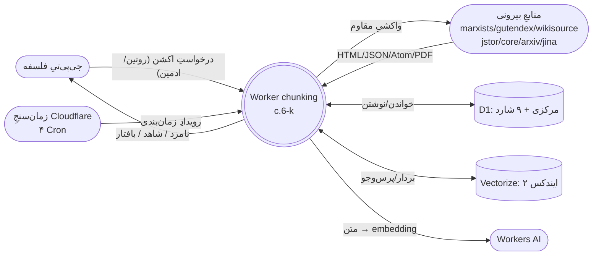
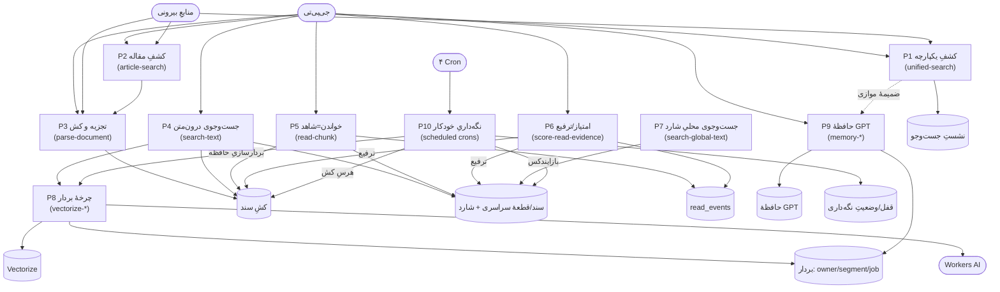
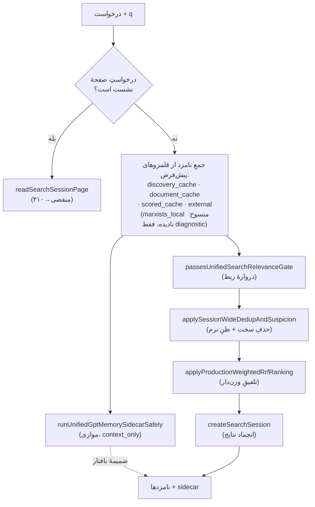
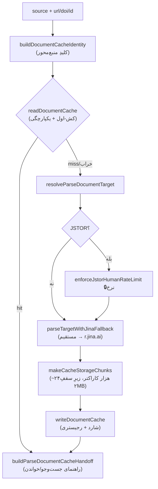
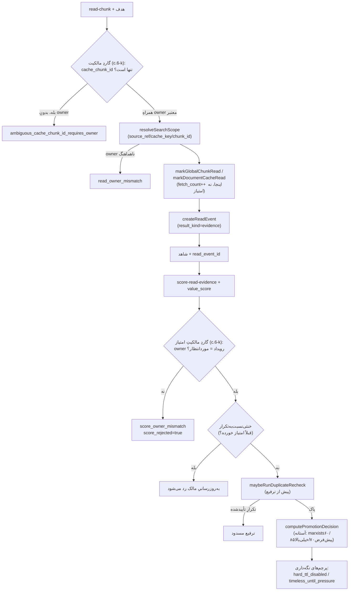
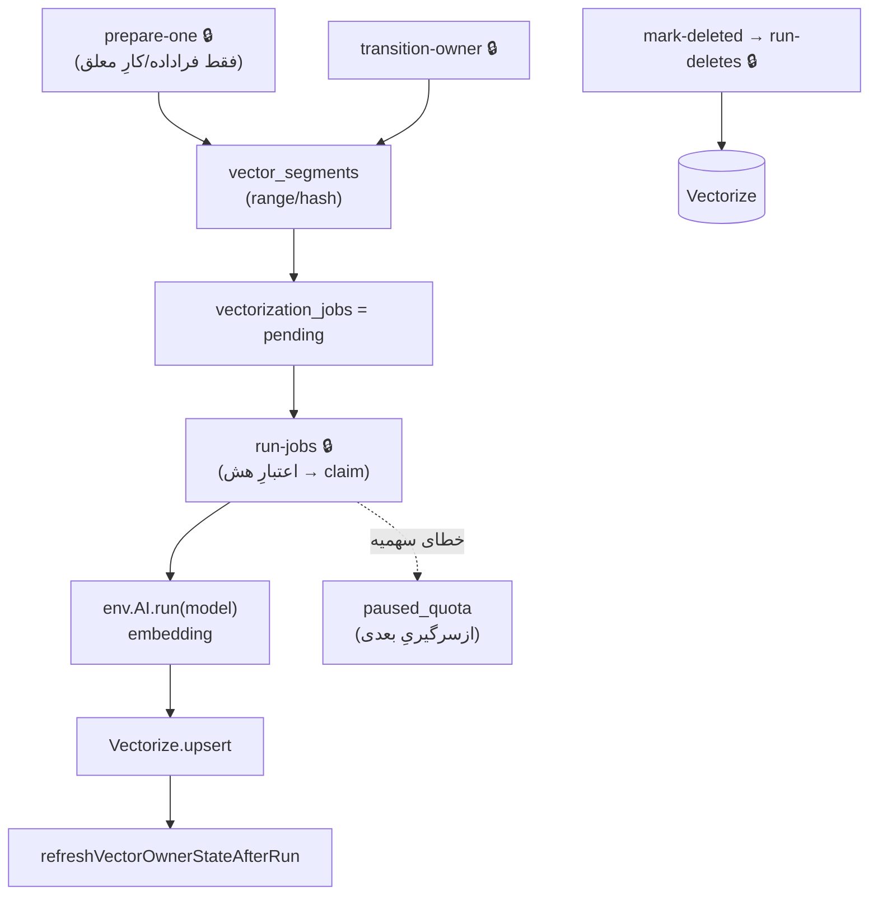
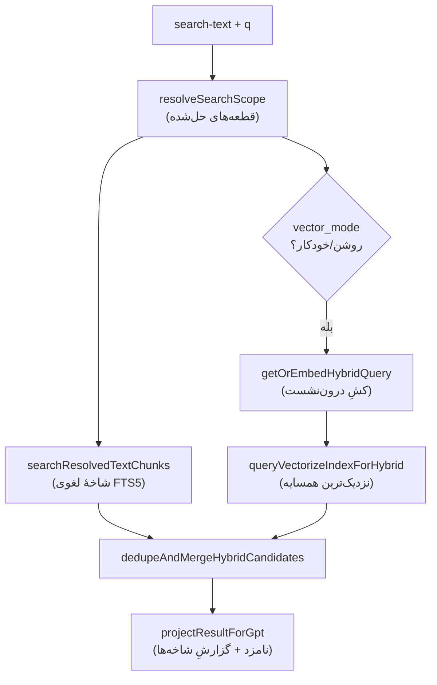
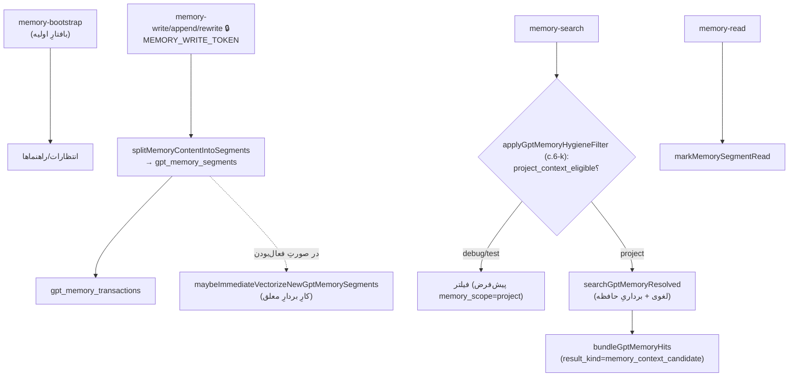
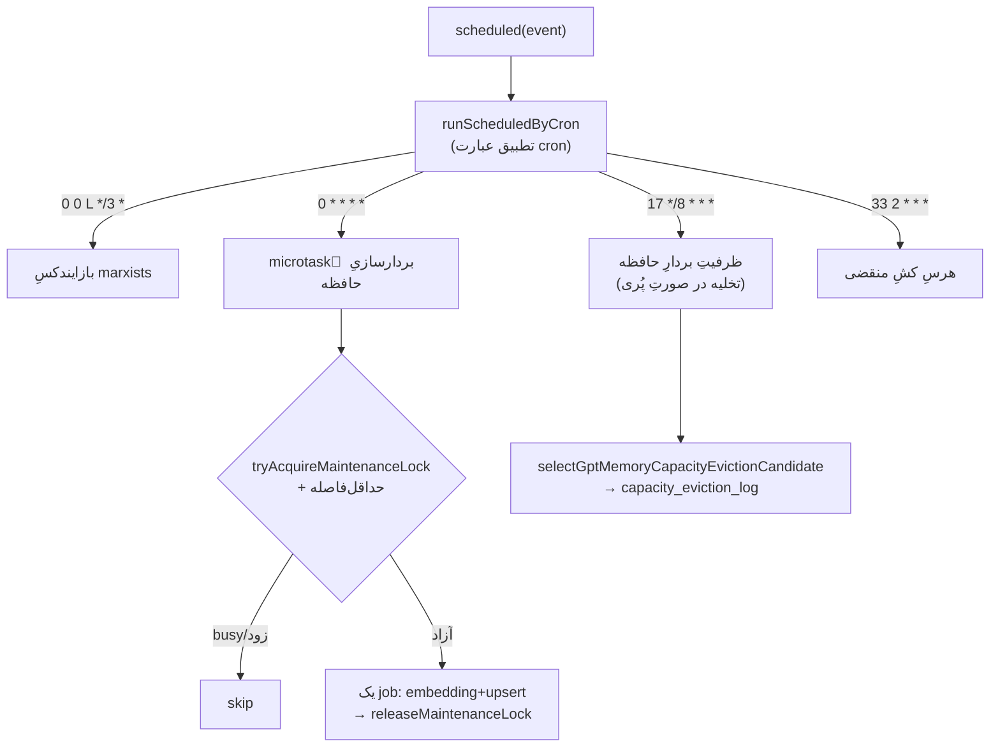

# نمودار جریان داده (Data Flow Diagram) — Open Classical Text Worker
### نسخهٔ `2.9.40-c.6-k` · سطوح ۰، ۱، ۲

> این سند جریانِ داده را در سه سطح نشان می‌دهد. در استعارهٔ کارخانه: **فرایند** = ماشین، **جریان** = لوله، **انبار** = مخزنِ داده. هر لوله منطقِ عبور دارد؛ به برخی داده‌ها اجازهٔ عبور می‌دهد، برخی را تغییرِ شکل/بسته‌بندی می‌کند تا برای مرحلهٔ بعد مساعد شود.

## نمادگذاری
- **فرایند (Process):** ماشینِ پردازنده (مستطیلِ گرد).
- **انبار داده (Data Store):** مخزن (استوانه/براکت).
- **موجودیتِ بیرونی (External Entity):** منبعِ بیرونِ کارخانه.
- **جریان (Flow):** پیکانِ جهت‌دارِ داده روی لوله.
- 🔒 = لولهٔ نیازمندِ احرازِ هویت.

---

## سطح ۰ — نمودار بافتار (Context Diagram)



---

## سطح ۱ — فرایندهای اصلی (۱۵ ماشینِ بزرگ)



---

## سطح ۲ — خطوطِ لولهٔ کلیدی

### خط ۱ — جست‌وجوی یکپارچه (unified-search) با ضمیمهٔ موازیِ حافظه


لوله‌ها: «دروازهٔ ربط» نامزدهای بی‌ربط را عبور نمی‌دهد؛ «dedup» تکراری‌های قطعی را ادغام و مشکوک‌ها را برچسب می‌زند؛ «RRF» ترتیب می‌دهد؛ «انجماد» نتیجه را برای صفحه‌بندی ثابت می‌کند. ضمیمهٔ حافظه از لولهٔ جداگانهٔ موازی می‌آید و **هرگز** وارد لولهٔ نامزد/RRF نمی‌شود.

### خط ۲ — تجزیهٔ سند (parse-document)



### خط ۳ — خواندن، امتیاز، ترفیع (read → score → promotion)



### خط ۴ — چرخهٔ حیاتِ بردار (vectorize lifecycle)



### خط ۵ — جست‌وجوی ترکیبیِ محلی (لغوی + برداری)



### خط ۶ — حافظهٔ GPT (memory)



### خط ۷ — نگه‌داریِ خودکارِ زمان‌بندی‌شده (scheduled, تازه در c.6)


لوله‌های این خط منطقِ «اجازهٔ عبور» دارند: قفلِ مشغول یا حداقل‌فاصلهٔ نرسیده، کار را عبور نمی‌دهد (skip)؛ فقط وقتی هر دو آزاد باشند، **یک** واحدِ کوچک عبور می‌کند.

### خط ۸ — دکوراتورِ فازِ صفر: گاید + قراردادِ لاغرِ wire (GS/GN..GR/HG..HK)

هر پاسخِ JSON، پیش از خروج از کارخانه، از یک ماشینِ پایانیِ واحد می‌گذرد: `attachPhaseZeroObservability` (بنرِ `[05]` در `worker.js`).

```mermaid
flowchart TD
    H["هر هندلر → json(data)"] --> K["تشخیص/الصاقِ result_kind\n+ گیتِ کیفیتِ شاهد (GU: PDFِ خام/CAPTCHA → diagnostic)"]
    K --> G["ساختِ gpt_guide:\nnext (فراخوانِ پُرشده) · preferred/also_possible\npage_next (فقط وقتی has_more) · error_code+remedy (خطا)"]
    G --> S{"فلگِ result_diagnostics_dev_mode؟"}
    S -->|خاموش (پیش‌فرض)| SLIM["سه denylist روی نسخهٔ wire:\nبخش‌های تلمتری + فیلدهای هر آیتم + sidecar\n(+حذفِ دوقلوی bundles و docِ legacy)"]
    S -->|روشن| FULL["پاسخِ کامل با کلِ تلمتری"]
    SLIM --> HOIST["hoistِ فیلدهای حیاتی به بالای JSON"]
    FULL --> HOIST
    HOIST --> OUT["پاسخ به GPT"]
```

نکتهٔ صحت: denylistها فقط کپیِ wire را می‌تراشند؛ نتایجِ ذخیره‌شده در search-session کامل می‌مانند، پس page-next و بازسازیِ بافتارِ امتیازدهی هیچ دیتایی از دست نمی‌دهند. مرجع: `WIRE_CONTRACT.md` (+ پاسبانِ `tools/wire-check.py`).
